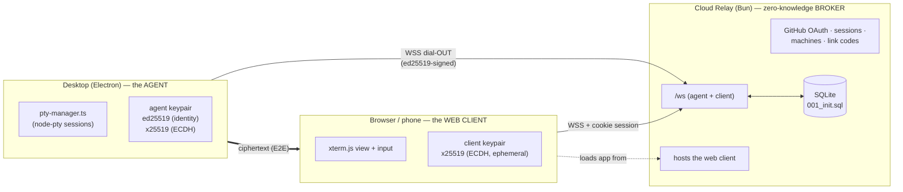

# Remote Hosting — E2E Cloud Relay

**Branch:** `feature/remote-hosting` · **Status:** design (M1 skeleton merged in `relay/`)

Lets a signed-in user reach their desktop Bodhilander — view and drive its
Claude Code / AI-CLI PTY sessions — from a browser or phone anywhere, with **no
inbound ports, no LAN requirement, and no user-managed tunnel.** The relay is a
**dumb, zero-knowledge broker**: it routes ciphertext between the desktop and the
web client and cannot read terminal traffic.

## Decisions (this redesign pass)

1. **Replace, don't augment.** The cloud relay becomes the *only* remote path.
   The shipped LAN + Tailscale-Funnel + mDNS + local-server + on-LAN-pairing
   stack is removed (see [§7 Migration](#7-what-gets-ripped-out)).
2. **End-to-end encrypted / zero-knowledge.** The relay brokers ciphertext only.
   Terminal I/O is encrypted between the desktop **agent** and the **web client**
   using x25519 (ECDH) + a symmetric AEAD; the relay never holds the keys.
3. **Self-host *or* hosted — same image.** One config-driven build serves a solo
   self-hoster (`docker compose up`) and a multi-tenant hosted deployment.
4. **GitHub OAuth** for user identity (matches the M1 schema + `GITHUB_CLIENT_ID`).

## Non-goals (v1)

- Being resilient against a **maliciously backdoored relay** without any user
  action — see the honest threat-model caveat in [§5](#5-end-to-end-encryption--threat-model). We
  reach *trust-on-first-use with out-of-band verification* (SSH-style), not
  magic.
- File sync, port forwarding, or arbitrary TCP tunneling. This relays PTY
  sessions and their control channel, nothing else.
- Federation between relays.

---

## 1. Roles



- **Agent** — the desktop app. Holds a long-lived **ed25519 identity keypair**
  (this *is* the machine's identity; `machines.ed25519_pubkey`) and an
  **x25519 keypair** for ECDH (`machines.x25519_pubkey`). Dials **out** to the
  relay over WSS and stays connected. Exposes exactly the PTY surface it already
  has (`src/main/pty-manager.ts`).
- **Relay** — the Bun service in `relay/`. Terminates TLS from both sides,
  authenticates them, and **routes opaque encrypted frames** between a client
  and the agent it names. Also: GitHub OAuth, cookie sessions, machine registry,
  link codes, and serving the web-client bundle. Stores only what
  `001_init.sql` defines. **Never sees plaintext terminal data.**
- **Web client** — the PWA (today `src/pwa/`), now served *by the relay* rather
  than the desktop. Generates an **ephemeral x25519 keypair per session**,
  performs ECDH against the agent's x25519 key, and encrypts/decrypts terminal
  I/O in the browser.

## 2. Data model

The M1 schema (`relay/src/db/migrations/001_init.sql`) already anticipates this;
no new tables for M2/M3. Column → purpose:

| Table | Role |
| --- | --- |
| `users`, `oauth_identities` | GitHub-authenticated account. |
| `sessions` | Web cookie sessions. `id` = SHA-256 of the bearer cookie (raw token never stored). |
| `machines` | One row per linked desktop. `ed25519_pubkey` (identity, UNIQUE), `x25519_pubkey` (ECDH), `last_seen_at`. |
| `link_codes` | Short-lived pending machine→account binding; carries both pubkeys until claimed. TTL = `LINK_CODE_TTL_SECONDS`. |
| `push_subscriptions` | Web-push (M4); wire shape (`endpoint`/`p256dh`/`auth`) is identical to the app's existing `push-subscriptions.ts`, so that code ports directly. |

## 3. Machine linking (M2)

Binds a desktop's ed25519 identity to a user account. Desktop-initiated,
because the desktop is the thing holding the private key.

```mermaid
sequenceDiagram
  participant D as Desktop agent
  participant R as Relay
  participant B as Browser (signed in)
  D->>D: generate ed25519 + x25519 keypairs (once), store in OS keychain
  D->>R: POST /link  { ed25519_pub, x25519_pub, machine_name }, signed by ed25519
  R->>R: insert link_codes(code_hash, pubkeys, status=pending, TTL)
  R-->>D: { code:"ABCD-1234" }  (raw code; only its hash is stored)
  D->>D: display code to user
  B->>R: POST /link/claim { code }  (cookie-authenticated)
  R->>R: verify code + TTL, move pubkeys → machines(user_id=me), status=completed
  R-->>B: { machine }
  R-->>D: (agent's next poll/WS) linked → proceed to connect
```

- Codes are random, single-use, TTL-bounded, compared timing-safe, and only the
  **hash** is persisted (mirrors the existing `pairing-manager.ts` discipline).
- The agent **signs** the `/link` request with its ed25519 key, so the pubkey it
  registers is one it controls (no registering someone else's key).
- Keypairs are generated once and stored in the OS keychain via Electron
  `safeStorage` — the same mechanism `src/main/key-vault.ts` already uses for
  provider API keys. **New client-side crypto** (there is no ed25519/x25519 in
  the app today — confirmed by grep); add via `sodium-native` (already a listed
  native dep of the app) or Node's `crypto` (Node ≥ ships Ed25519/X25519 in
  `webcrypto`).

## 4. Session establishment (M3)

Both parties are connected to `/ws`: the agent authenticates with an
ed25519-signed challenge; the client authenticates with its cookie session. The
relay pairs a client to a chosen machine and then blindly forwards frames.

```mermaid
sequenceDiagram
  participant B as Web client
  participant R as Relay (blind)
  participant D as Desktop agent
  Note over D,R: agent already connected: signed nonce → verified vs machines.ed25519_pubkey
  B->>R: open /ws (cookie), { open_session, machine_id, client_x25519_pub }
  R->>D: forward { client_x25519_pub, session_id }
  D->>D: ECDH(agent_x25519_priv, client_x25519_pub) → shared key K
  D->>R: { agent_x25519_pub, sig = ed25519_sign(agent_x25519_pub || session_id) }
  R->>B: forward { agent_x25519_pub, sig }
  B->>B: verify sig vs machine's ed25519 pubkey; ECDH → same K
  Note over B,D: all subsequent terminal:* frames are AEAD-sealed under K
  B->>R: { session_id, ciphertext }   %% terminal:input
  R->>D: forward ciphertext (relay cannot read)
  D->>B: forward ciphertext (terminal:output / exit)
```

- **Inside the tunnel we reuse the existing terminal vocabulary** —
  `terminal:subscribe` / `input` / `resize` / `output` / `exit`, plus
  `session:state` and `sessions:updated` (defined today in
  `src/main/api/ws-server.ts` and `src/pwa/src/lib/ws.ts`). The transport and
  auth are replaced; the message semantics survive, so the PTY-forwarding logic
  and the xterm.js client port over largely intact.
- **Permission model** (`canControl` / `canModify`, from `pairing-manager.ts`)
  moves to a per-machine or per-link grant enforced by the **agent** (the relay
  can't, since it can't read the frames).

## 5. End-to-end encryption & threat model

**What the relay can see:** connection metadata — which user, which machine,
session timing, byte counts. **What it cannot see:** terminal contents (keystrokes,
output), because those are AEAD-sealed under `K = ECDH(agent, client)`.

**The honest caveat (the hard part).** The client learns the agent's x25519 key
*through the relay*. A malicious relay could substitute its own key and MITM the
session. We defend exactly as SSH/Signal do — the agent **signs** its ephemeral
x25519 key with its **ed25519 identity key** (step in §4), and the client
verifies that signature against the machine's ed25519 pubkey. That reduces the
problem to: *does the client trust the right ed25519 pubkey?*

- **Self-host (single trust domain):** the operator trusts their own relay; TOFU
  is fine.
- **Hosted (relay is a third party):** the relay serves the ed25519 pubkey the
  client pins, so a backdoored relay *could* lie **on first link**. Mitigation:
  show the machine's ed25519 **fingerprint** on the desktop and let the user
  verify it in the web UI at link time (SSH-host-key / Signal-safety-number
  UX). After first link the pubkey is pinned; later substitution is detected.
  This is a v1 *non-goal to fully automate* — we ship the fingerprint UX and
  document the trust model plainly.

**Primitives:** x25519 ECDH → HKDF → XChaCha20-Poly1305 (or
`crypto_secretbox`), random 24-byte nonce per frame, monotonic counter to reject
replays. All available in `sodium-native` (desktop) and libsodium-wasm /
WebCrypto (browser).

## 6. Deployment — self-host *or* hosted (same image)

The Bun image is unchanged between modes; behavior is config-driven:

| Concern | Self-host | Hosted |
| --- | --- | --- |
| TLS | operator's existing proxy / LB (compose does **not** ship Caddy) | platform LB |
| `SESSION_SECRET` | required (prod guard already enforces) | required |
| GitHub OAuth app | operator registers their own | one shared app |
| Sign-up | open, or restrict `ALLOWED_ORIGINS` / an allowlist | quota + abuse controls |
| DB | SQLite on a volume (M1) | SQLite is fine to start; Postgres adapter is a later seam |
| Rate limits / quotas | lax | enforced (connections, machines/user) |

A single `DEPLOYMENT_MODE` (or inferring from presence of an allowlist) gates
the hosted-only concerns (quotas, abuse). SQLite access is already isolated
behind `relay/src/db/index.ts`, so a Postgres backend is a driver swap, not a
rewrite.

## 7. What gets ripped out

"Replace entirely" means removing the LAN era. Concretely (desktop app):

- `src/main/api/discovery/mdns-advertiser.ts` — mDNS advertising. **Delete.**
- Tailscale-Funnel guidance UI — `src/renderer/components/SettingsModal.tsx`
  (~L920–963). **Replace** with relay link/status UI.
- Local inbound server binding `0.0.0.0:8443` and its LAN gate —
  `src/main/api/index.ts`, `http-server.ts` (`localNetworkOnly`, RFC1918 +
  Tailscale CGNAT allow-list). **Delete** the inbound listener; the agent only
  dials out.
- On-LAN pairing (6-digit + QR) — `src/main/api/pairing/pairing-manager.ts`,
  `routes/pairing.ts`, PWA `Pair.tsx`. **Replace** with the relay link-code flow (§3).
- The PWA served at `/m/*` by the desktop — moves to being served **by the
  relay** (`http-server.ts:136` mount goes away; `relay/` serves the bundle, M4).

**Preserved / ported:** `pty-manager.ts` (unchanged), the `terminal:*` WS
message vocabulary (now E2E-tunneled), the xterm.js client, and the web-push
schema/logic. Removal should land behind the relay path being functional, or as
a clean sequenced PR on this branch, to avoid a window with no remote path.

## 8. Milestones

| M | Scope | State |
| --- | --- | --- |
| **M1** | Relay skeleton: config, logging, DB + migrations, `/health`, `/ws` stub, Bun + Docker. | **Done** (`relay/`, hardened). |
| **M2** | GitHub OAuth + cookie sessions; machine linking (§3); desktop keypair generation + keychain storage; agent WSS dial-out with ed25519 challenge auth. | next |
| **M3** | Live relay protocol (§4): client↔agent pairing, E2E handshake, ciphertext forwarding of the `terminal:*` channel; fingerprint-verification UX. | — |
| **M4+** | Relay-hosted web client bundle; quotas/abuse for hosted mode; (later) Postgres backend. | — |
| **M5.3** | Web push (§10) — note this table once said "web-push **from the relay**", and that is precisely what it is not: the agent seals, the relay forwards. | **Done** |

## 9. Open questions / risks

1. **Agent auth on `/ws`:** ed25519 challenge-response (relay sends nonce, agent
   signs) vs a bearer machine-token minted at link time. Challenge-response
   keeps the private key as the sole credential; leaning that way.
2. **Multiple web clients on one session** (phone + laptop): fan-out means each
   client does its own ECDH; agent seals per-recipient, or a shared session key
   is wrapped to each. Decide in M3.
3. **Reconnect / session resume** across agent WSS drops — buffer scrollback on
   the agent (it already has `GET /:sessionId/buffer`), replay after re-handshake.
4. **Browser crypto surface:** WebCrypto X25519/Ed25519 support varies; a
   libsodium-wasm fallback removes the variance at ~100KB. Confirm target
   browsers.
5. **Fingerprint UX** is the crux of the hosted trust story — needs real design,
   not just a hex string.
```

## 10. Web push, and what the relay is allowed to know (M5.3)

The attention model — "needs you" sorting, the count chip, the banner — was
driven by a 2.5s poll that died with the tab. Push replaces that for the case
that matters: the phone is locked, the tab is closed, and a session has stopped
to ask a question.

This ran straight into §5. A push notification is only useful if it says *which*
session; session names are end-to-end material, and the relay is the one party
we have spent this whole design keeping them away from. The issue offered two
ways out, and the decision was deliberate.

### The decision: the agent seals, the relay forwards

**Option (a)** was relay-composed payloads carrying only what the relay already
knows: *"A session needs you on **laptop**"*. Cheap, and it gives up the thing
that makes the notification worth sending.

**Option (b)**, which is what shipped: the **desktop agent** performs the RFC
8291 `aes128gcm` content encryption itself, against the browser subscription's
own `p256dh`/`auth`, and the relay forwards a body it holds no key for. The
notification says `deploy-prod · Waiting for your input`, and the relay never
learns either half.

Web Push separates two jobs that are easy to run together, and (b) is exactly
the seam between them:

| | Who does it | Why |
| --- | --- | --- |
| **Identification** (VAPID, an ES256 JWT) | relay | the browser subscribed with the relay's application-server key, so only the relay can sign for it |
| **Confidentiality** (`aes128gcm` content encoding) | **agent** | the payload contains a session name, which the relay must not learn |

So the message is assembled by two parties who each hold exactly what their half
needs, and neither holds the other's.

### What it cost, honestly

Less than expected, and the reason is worth recording. RFC 8291 is one ECDH, two
HKDF derivations and one AES-128-GCM record — all of it in Node's `crypto`, no
new dependency (`src/main/api/relay/push-seal.ts`, ~90 lines). The desktop
already carried a full `web-push` stack for the legacy LAN PWA, and it was read
before anything was written; it was **not** reused, for two reasons. It requires
a subscription *endpoint* to build a request, and the agent is deliberately never
told one (below). And its VAPID details are module-global state shared with the
LAN dispatcher in the same process, so suppressing the header it would otherwise
add is action at a distance rather than a decision the code states.

The thing that made (b) affordable to trust rather than merely to write is that
RFC 8291 §5 publishes a complete worked example. `push-seal.test.ts` reproduces
it byte for byte, so the encryption is pinned to an answer nobody in this
repository chose. A round-trip test — encrypt, then decrypt with the private
half — would have passed just as happily with a matched pair of mistakes.

### What (b) buys, and what it does not

It buys **confidentiality against the relay as it actually runs**: a push
payload is ciphertext in the relay's process, in its logs, in its database, and
in anything an operator or an attacker reads out of them. That is the property
§5 already claims for terminal frames, extended to the one new channel that
would otherwise have quietly broken it.

It does **not** make the relay untrusted. The relay holds `p256dh`/`auth`
because the browser hands them over at subscribe time, so a *malicious* relay
could seal a payload of its own invention and deliver it as though it came from
the machine. Push is therefore authenticated no more strongly than the sign-in
that created the subscription — a notification is a prompt to go and look, never
evidence of anything. Making push unforgeable would need the agent's ed25519
identity over the payload and a verification step in the worker, which is a
larger change than this one and is not pretended to be here.

### Wire vocabulary

Two messages, in the shape §4 and M5.2 already use. Both ride the existing agent
socket; nothing new is opened.

- **`push:sync`** (relay → agent) — the owner's subscriptions as `{ id, p256dh,
  auth }`. Sent after `agent:ready` alongside `share:sync`, and again whenever
  the set changes (subscribe, unsubscribe, or a 410 reaped mid-send). The agent
  replaces its list wholesale rather than merging: the relay is where every
  subscription change lands, so a merge would resurrect a device its owner had
  just switched off.

  **The endpoint is deliberately absent.** The agent encrypts; the relay
  addresses. This is §5's minimal-disclosure rule pointed the other way — the
  desktop has no need to learn which push service, and therefore which device
  family, its owner reads notifications on, so it is not told.

- **`push:send`** (agent → relay) — `{ items: [{ id, body }] }`, one sealed body
  per subscription, base64. The relay checks each `id` belongs to the owner of
  the machine on the other end of *that* socket, POSTs it with the VAPID
  envelope, and reaps the row on 404/410. It cannot check anything about the
  contents, which is the point.

Gated on a new capability, `push:v1`, advertised in `agent:auth` next to
`grants:v1`. This is minimal disclosure again rather than version tolerance: an
older agent would ignore `push:sync` while the subscription keys sat in its
process memory, so a build that cannot seal is not given keys to hold. No
capability, no keys, no push — the phone stays quiet until the desktop updates,
which is the honest outcome.

### Key provisioning

`VAPID_PUBLIC_KEY` / `VAPID_PRIVATE_KEY` (base64url, the shape `npx web-push
generate-vapid-keys` prints) if set; otherwise the relay mints a P-256 pair on
first use and keeps it in the `kv` table. `VAPID_SUBJECT` — parsed since M1 and
read by nothing until now — is the `sub` claim.

The public key is baked into every browser subscription, so **it must be stable
across restarts**. Minting per boot would leave every subscribed device holding
a key nothing signs with any more, and the push service would answer 403 in a
way that looks like nothing in particular from either end. Hence the persistence,
and hence the production warning when the pair is left to the database: a
disposable volume silently unsubscribes every device on it.

### The SSRF boundary

`endpoint` arrives in a request body from whoever holds a browser, and the relay
later makes an outbound POST to it. Unchecked, "subscribe" is a general-purpose
*make the relay send bytes to a URL of my choosing from inside its network*
primitive, which reaches cloud metadata services and anything else its egress
can see. `isAllowedPushEndpoint` therefore requires HTTPS, no credentials, no
explicit port, and a dotted hostname that is not an address literal, `.local`,
`.internal` or `.localhost`.

It runs at subscribe time and again at send. Be precise about what that buys:
**both look at the same string, and neither sees where the request lands.** The
second check exists so a row stored before a rule tightened cannot be used, not
because it validates anything new.

Two ways past a string check, one of which needed no cleverness at all:

- **Redirects.** `fetch` follows by default, preserving POST and body across the
  hop, so an endpoint that passes every rule above can answer `307 Location:
  http://169.254.169.254/…` and the relay dials a URL nothing checked. Every
  property this list enforces is discarded at the first hop. Closed by
  `redirect: 'manual'`, treating any 3xx as a delivery failure — a real push
  service never redirects, so it costs nothing. Deliberately **not** counted as
  `gone`: reaping deletes the row and re-syncs the agent, which is a reply
  channel, and an attacker watching it gets exists/doesn't-exist for every probe.
- **The trailing dot.** `URL` preserves it, so `metadata.google.internal.`
  resolves to the same host as the name the suffix list refuses, and `localhost.`
  additionally satisfies the "must contain a dot" rule. Stripped before matching.

What is still open: a hostname that *resolves* to a private address. Closing it
needs resolution-time filtering the runtime does not expose, so it is recorded
rather than papered over: **do not treat the relay's outbound egress as
trusted.** Each delivery carries a 10s timeout — **per item, not per batch**,
because the items are sent in sequence: a fan-out of dead-slow endpoints can
still delay the reap re-sync by the sum of them. Bounding the batch would need
the sends to run concurrently, which is a change to make deliberately rather
than as a side effect of a timeout.

### Debounce, and what is out of scope

The trigger is the same `handleStateChange` hook the desktop notifier and the
LAN dispatcher already hang off, with the same window: per `(sessionId, state)`,
30 seconds, in a map bounded by oldest-first eviction. Sessions genuinely flap
between `waiting` and `working` mid-stream, and two paths disagreeing about that
would surface as "notifications are broken", not as a race. The windows survive
a socket reconnect deliberately — a bounce mid-flap is precisely when resetting
them would let the storm through — and are cleared only when remote hosting is
switched off, which is a decision rather than a blip.

**A subscription belongs to an account, not to a browser.** Signing out drops it
first, before the local wipe; taking an endpoint over — a shared device changing
hands — deletes and re-creates the row rather than reassigning its `user_id`, so
the per-account cap applies to the new owner and the displaced account's agents
are re-synced. `endpoint` is `UNIQUE` globally in migration 001, which is why
this is a delete-then-insert rather than a per-user uniqueness constraint.

**An agent that cannot seal is surfaced, not just handled.** `push:v1` gating is
honest at the protocol layer and was silent at the UI layer, which is the state
a window after every relay deploy sits in: both subscribe calls succeed, the
sheet says notifications are on, and nothing will ever arrive. `/api/machines`
now carries `pushCapable` for owned machines — true, false, or null when the
agent is offline and the relay genuinely does not know — and the client says so.

**The agent holds subscription keys only while connected.** Every path that
ends a connection releases them — including the ordinary socket drop, which does
NOT run the client's teardown and so kept them until a spec said otherwise. The
relay re-states the list on the next `agent:ready`, so nothing is lost, and a
revocation heard while the agent was away cannot be acted on from a stale copy.

**A refused batch is nacked.** The relay's per-machine rate limit used to drop
silently, which spent the agent's 30s debounce on a notification that never
left; those sessions then stayed quiet until their next state change. The relay
sends `push:throttled` and the agent reopens the window it spent. The agent
queues those windows rather than holding one: a burst runs every send in a
single tick, long before the first nack returns, so one slot would hand back one
window and lose the rest — which is the fleet-restart case this exists for.

**Guests do not get push.** Subscriptions are per user and the relay fans out to
the machine *owner* only. A guest's client still has the poll, the sorting and
the banner; what they do not get is a locked phone buzzing about someone else's
machine. Extending it would mean deciding whose sessions a guest may be alerted
about at all, which is a sharing-policy question rather than a delivery one.
