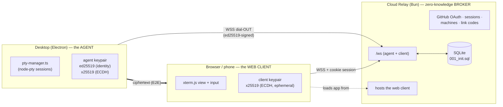

# Remote Hosting — E2E Cloud Relay

**Branch:** `feature/remote-hosting` · **Status:** design (M1 skeleton merged in `relay/`)

Lets a signed-in user reach their desktop Bodhilander — view and drive its
Claude Code / AI-CLI PTY sessions — from a browser or phone anywhere, with **no
inbound ports, no LAN requirement, and no user-managed tunnel.** The relay is a
**dumb, zero-knowledge broker**: it routes ciphertext between the desktop and the
web client and cannot read terminal traffic.

## Decisions (this redesign pass)

1. **Replace, don't augment.** The cloud relay becomes the *only* remote path.
   The shipped LAN + Tailscale-Funnel + mDNS + local-server + on-LAN-pairing
   stack is removed (see [§7 Migration](#7-what-gets-ripped-out)).
2. **End-to-end encrypted / zero-knowledge.** The relay brokers ciphertext only.
   Terminal I/O is encrypted between the desktop **agent** and the **web client**
   using x25519 (ECDH) + a symmetric AEAD; the relay never holds the keys.
3. **Self-host *or* hosted — same image.** One config-driven build serves a solo
   self-hoster (`docker compose up`) and a multi-tenant hosted deployment.
4. **GitHub OAuth** for user identity (matches the M1 schema + `GITHUB_CLIENT_ID`).

## Non-goals (v1)

- Being resilient against a **maliciously backdoored relay** without any user
  action — see the honest threat-model caveat in [§5](#5-end-to-end-encryption--threat-model). We
  reach *trust-on-first-use with out-of-band verification* (SSH-style), not
  magic.
- File sync, port forwarding, or arbitrary TCP tunneling. This relays PTY
  sessions and their control channel, nothing else.
- Federation between relays.

---

## 1. Roles



- **Agent** — the desktop app. Holds a long-lived **ed25519 identity keypair**
  (this *is* the machine's identity; `machines.ed25519_pubkey`) and an
  **x25519 keypair** for ECDH (`machines.x25519_pubkey`). Dials **out** to the
  relay over WSS and stays connected. Exposes exactly the PTY surface it already
  has (`src/main/pty-manager.ts`).
- **Relay** — the Bun service in `relay/`. Terminates TLS from both sides,
  authenticates them, and **routes opaque encrypted frames** between a client
  and the agent it names. Also: GitHub OAuth, cookie sessions, machine registry,
  link codes, and serving the web-client bundle. Stores only what
  `001_init.sql` defines. **Never sees plaintext terminal data.**
- **Web client** — the PWA (today `src/pwa/`), now served *by the relay* rather
  than the desktop. Generates an **ephemeral x25519 keypair per session**,
  performs ECDH against the agent's x25519 key, and encrypts/decrypts terminal
  I/O in the browser.

## 2. Data model

The M1 schema (`relay/src/db/migrations/001_init.sql`) already anticipates this;
no new tables for M2/M3. Column → purpose:

| Table | Role |
| --- | --- |
| `users`, `oauth_identities` | GitHub-authenticated account. |
| `sessions` | Web cookie sessions. `id` = SHA-256 of the bearer cookie (raw token never stored). |
| `machines` | One row per linked desktop. `ed25519_pubkey` (identity, UNIQUE), `x25519_pubkey` (ECDH), `last_seen_at`. |
| `link_codes` | Short-lived pending machine→account binding; carries both pubkeys until claimed. TTL = `LINK_CODE_TTL_SECONDS`. |
| `push_subscriptions` | Web-push (M4); wire shape (`endpoint`/`p256dh`/`auth`) is identical to the app's existing `push-subscriptions.ts`, so that code ports directly. |

## 3. Machine linking (M2)

Binds a desktop's ed25519 identity to a user account. Desktop-initiated,
because the desktop is the thing holding the private key.

```mermaid
sequenceDiagram
  participant D as Desktop agent
  participant R as Relay
  participant B as Browser (signed in)
  D->>D: generate ed25519 + x25519 keypairs (once), store in OS keychain
  D->>R: POST /link  { ed25519_pub, x25519_pub, machine_name }, signed by ed25519
  R->>R: insert link_codes(code_hash, pubkeys, status=pending, TTL)
  R-->>D: { code:"ABCD-1234" }  (raw code; only its hash is stored)
  D->>D: display code to user
  B->>R: POST /link/claim { code }  (cookie-authenticated)
  R->>R: verify code + TTL, move pubkeys → machines(user_id=me), status=completed
  R-->>B: { machine }
  R-->>D: (agent's next poll/WS) linked → proceed to connect
```

- Codes are random, single-use, TTL-bounded, compared timing-safe, and only the
  **hash** is persisted (mirrors the existing `pairing-manager.ts` discipline).
- The agent **signs** the `/link` request with its ed25519 key, so the pubkey it
  registers is one it controls (no registering someone else's key).
- Keypairs are generated once and stored in the OS keychain via Electron
  `safeStorage` — the same mechanism `src/main/key-vault.ts` already uses for
  provider API keys. **New client-side crypto** (there is no ed25519/x25519 in
  the app today — confirmed by grep); add via `sodium-native` (already a listed
  native dep of the app) or Node's `crypto` (Node ≥ ships Ed25519/X25519 in
  `webcrypto`).

## 4. Session establishment (M3)

Both parties are connected to `/ws`: the agent authenticates with an
ed25519-signed challenge; the client authenticates with its cookie session. The
relay pairs a client to a chosen machine and then blindly forwards frames.

```mermaid
sequenceDiagram
  participant B as Web client
  participant R as Relay (blind)
  participant D as Desktop agent
  Note over D,R: agent already connected: signed nonce → verified vs machines.ed25519_pubkey
  B->>R: open /ws (cookie), { open_session, machine_id, client_x25519_pub }
  R->>D: forward { client_x25519_pub, session_id }
  D->>D: ECDH(agent_x25519_priv, client_x25519_pub) → shared key K
  D->>R: { agent_x25519_pub, sig = ed25519_sign(agent_x25519_pub || session_id) }
  R->>B: forward { agent_x25519_pub, sig }
  B->>B: verify sig vs machine's ed25519 pubkey; ECDH → same K
  Note over B,D: all subsequent terminal:* frames are AEAD-sealed under K
  B->>R: { session_id, ciphertext }   %% terminal:input
  R->>D: forward ciphertext (relay cannot read)
  D->>B: forward ciphertext (terminal:output / exit)
```

- **Inside the tunnel we reuse the existing terminal vocabulary** —
  `terminal:subscribe` / `input` / `resize` / `output` / `exit`, plus
  `session:state` and `sessions:updated` (defined today in
  `src/main/api/ws-server.ts` and `src/pwa/src/lib/ws.ts`). The transport and
  auth are replaced; the message semantics survive, so the PTY-forwarding logic
  and the xterm.js client port over largely intact.
- **Permission model** (`canControl` / `canModify`, from `pairing-manager.ts`)
  moves to a per-machine or per-link grant enforced by the **agent** (the relay
  can't, since it can't read the frames).

## 5. End-to-end encryption & threat model

**What the relay can see:** connection metadata — which user, which machine,
session timing, byte counts. **What it cannot see:** terminal contents (keystrokes,
output), because those are AEAD-sealed under `K = ECDH(agent, client)`.

**The honest caveat (the hard part).** The client learns the agent's x25519 key
*through the relay*. A malicious relay could substitute its own key and MITM the
session. We defend exactly as SSH/Signal do — the agent **signs** its ephemeral
x25519 key with its **ed25519 identity key** (step in §4), and the client
verifies that signature against the machine's ed25519 pubkey. That reduces the
problem to: *does the client trust the right ed25519 pubkey?*

- **Self-host (single trust domain):** the operator trusts their own relay; TOFU
  is fine.
- **Hosted (relay is a third party):** the relay serves the ed25519 pubkey the
  client pins, so a backdoored relay *could* lie **on first link**. Mitigation:
  show the machine's ed25519 **fingerprint** on the desktop and let the user
  verify it in the web UI at link time (SSH-host-key / Signal-safety-number
  UX). After first link the pubkey is pinned; later substitution is detected.
  This is a v1 *non-goal to fully automate* — we ship the fingerprint UX and
  document the trust model plainly.

**Primitives:** x25519 ECDH → HKDF → XChaCha20-Poly1305 (or
`crypto_secretbox`), random 24-byte nonce per frame, monotonic counter to reject
replays. All available in `sodium-native` (desktop) and libsodium-wasm /
WebCrypto (browser).

## 6. Deployment — self-host *or* hosted (same image)

The Bun image is unchanged between modes; behavior is config-driven:

| Concern | Self-host | Hosted |
| --- | --- | --- |
| TLS | operator's existing proxy / LB (compose does **not** ship Caddy) | platform LB |
| `SESSION_SECRET` | required (prod guard already enforces) | required |
| GitHub OAuth app | operator registers their own | one shared app |
| Sign-up | open, or restrict `ALLOWED_ORIGINS` / an allowlist | quota + abuse controls |
| DB | SQLite on a volume (M1) | SQLite is fine to start; Postgres adapter is a later seam |
| Rate limits / quotas | lax | enforced (connections, machines/user) |

A single `DEPLOYMENT_MODE` (or inferring from presence of an allowlist) gates
the hosted-only concerns (quotas, abuse). SQLite access is already isolated
behind `relay/src/db/index.ts`, so a Postgres backend is a driver swap, not a
rewrite.

## 7. What gets ripped out

"Replace entirely" means removing the LAN era. Concretely (desktop app):

- `src/main/api/discovery/mdns-advertiser.ts` — mDNS advertising. **Delete.**
- Tailscale-Funnel guidance UI — `src/renderer/components/SettingsModal.tsx`
  (~L920–963). **Replace** with relay link/status UI.
- Local inbound server binding `0.0.0.0:8443` and its LAN gate —
  `src/main/api/index.ts`, `http-server.ts` (`localNetworkOnly`, RFC1918 +
  Tailscale CGNAT allow-list). **Delete** the inbound listener; the agent only
  dials out.
- On-LAN pairing (6-digit + QR) — `src/main/api/pairing/pairing-manager.ts`,
  `routes/pairing.ts`, PWA `Pair.tsx`. **Replace** with the relay link-code flow (§3).
- The PWA served at `/m/*` by the desktop — moves to being served **by the
  relay** (`http-server.ts:136` mount goes away; `relay/` serves the bundle, M4).

**Preserved / ported:** `pty-manager.ts` (unchanged), the `terminal:*` WS
message vocabulary (now E2E-tunneled), the xterm.js client, and the web-push
schema/logic. Removal should land behind the relay path being functional, or as
a clean sequenced PR on this branch, to avoid a window with no remote path.

## 8. Milestones

| M | Scope | State |
| --- | --- | --- |
| **M1** | Relay skeleton: config, logging, DB + migrations, `/health`, `/ws` stub, Bun + Docker. | **Done** (`relay/`, hardened). |
| **M2** | GitHub OAuth + cookie sessions; machine linking (§3); desktop keypair generation + keychain storage; agent WSS dial-out with ed25519 challenge auth. | next |
| **M3** | Live relay protocol (§4): client↔agent pairing, E2E handshake, ciphertext forwarding of the `terminal:*` channel; fingerprint-verification UX. | — |
| **M4+** | Relay-hosted web client bundle; web-push from the relay; quotas/abuse for hosted mode; (later) Postgres backend. | — |

## 9. Open questions / risks

1. **Agent auth on `/ws`:** ed25519 challenge-response (relay sends nonce, agent
   signs) vs a bearer machine-token minted at link time. Challenge-response
   keeps the private key as the sole credential; leaning that way.
2. **Multiple web clients on one session** (phone + laptop): fan-out means each
   client does its own ECDH; agent seals per-recipient, or a shared session key
   is wrapped to each. Decide in M3.
3. **Reconnect / session resume** across agent WSS drops — buffer scrollback on
   the agent (it already has `GET /:sessionId/buffer`), replay after re-handshake.
4. **Browser crypto surface:** WebCrypto X25519/Ed25519 support varies; a
   libsodium-wasm fallback removes the variance at ~100KB. Confirm target
   browsers.
5. **Fingerprint UX** is the crux of the hosted trust story — needs real design,
   not just a hex string.
```
