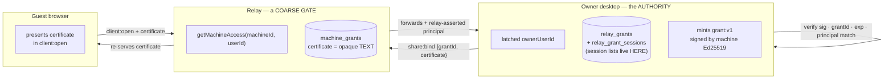

# Session Sharing — Multi-User Access to a Relayed Machine

**Branch:** `feature/session-sharing` · **Status:** design · **Extends:**
[`remote-hosting-relay.md`](./remote-hosting-relay.md) §4–§5, §8

Lets a machine owner share **one named session** with another relay user, who can
**watch**, or (with a much heavier consent step) **watch and type**. The relay decides
*who may open a channel*; the desktop agent decides *what they may do*. This makes real
the split §4 of the relay design already pre-committed to — "enforced by the **agent**
(the relay can't, since it can't read the frames)."

> **Read §1 first.** Two findings reframe this feature: there is a **live replay flaw in
> the shipped M3 tunnel** that must be fixed before a second user exists, and
> **"watch and type" is a machine-trust decision, not a session-scoped one.** Neither is
> negotiable by UI copy.

## Decisions

1. **Harden before sharing.** M5.0 ships security fixes to the *existing single-user*
   tunnel with no user-visible change. Sharing multiplies channels per machine and puts
   channel establishment under untrusted control; today's defects are survivable with one
   owner and are not with guests.
2. **Session-scoped, never machine-scoped.** A grant names an explicit session list. There
   is no "share my machine" option.
3. **The relay is a coarse gate, not an authority.** `ws.ts:159`'s ownership check becomes
   `getMachineAccess(machineId, userId)`, and its answer only decides whether a socket is
   worth brokering. The agent re-derives every capability from a certificate it signed.
4. **Grants are keyed by `grantId`, not by (machine, person).** Sharing a second session
   with the same colleague is the first thing anyone will do; it must be a second grant,
   never an in-place widening of the first.
5. **No stored owner certificate.** The owner path stays an explicit branch gated by a
   desktop-latched owner id (§3). A machine-wide bearer cert sitting in the relay's DB is
   a skeleton key, not a simplification.
6. **Guests are structurally invisible to the relay's session list.** No session id ever
   reaches the relay; scope lives in the desktop's own tables.
7. **Presence ships with the first guest, not after.** Silent read access to a live
   terminal is the same class of harm as silent write access.

## Non-goals (v1)

Machine-wide grants · guest-initiated sharing · sharing scrollback history · guest-driven
`terminal:resize` · `session:create` / `group:create` / `dirs:list` for any guest, ever ·
browser-held guest device keys · session recording · federation of grants between relays.

---

## 1. Two findings that shape everything

### 1.1 The shipped tunnel is replayable (fix before sharing)

The M3 handshake derives the session key from the machine's **long-lived** X25519 key, and
the Ed25519 proof signs only the two public keys:

```
buildHandshakeProof → `e2e-handshake:v1\n<clientPub>\n<agentPub>`   (e2e.ts:86)
deriveSharedSecret  → ECDH(static agent X25519 priv, clientPub)    (relay-identity.ts:111)
recvCounter          = -1 on every new channel                      (session-tunnel.ts:97)
```

Nothing binds a channel to a moment in time. A relay that logs one session can later open a
fresh client socket, present the **same** `clientX25519Pub`, and replay the recorded
ciphertext frames in order. The agent derives an identical key, `recvCounter` starts fresh,
every frame authenticates, and `dispatch()` executes it — re-running the owner's past
`terminal:input` and `session:create` verbatim. No cryptography is broken.

The same root cause gives **AES-GCM nonce reuse**: two concurrent channels sharing a
`clientX25519Pub` share a key and both start `sendCounter` at 0, so XOR of the two output
streams leaks plaintext. That is a direct break of the zero-knowledge property the relay
design promises, reachable by the exact party it names as untrusted.

**The fix is small and wire-compatible.** `relay/web/src/connection.ts:69-78` pins only
`machineEd25519Pub` and derives from whatever `agentX25519Pub` the *signed* proof carries.
So the agent switches to a **per-channel ephemeral X25519 keypair** with no web-client
change and no wire-format break — and it buys forward secrecy the design currently lacks.

> **Superseded (implemented in M5.0):** an earlier draft of this section also added a
> `channelNonce` to the proof and bumped it to `e2e-handshake:v2`. That is unnecessary and
> was dropped. Once the agent's key is per-channel, the proof already covers a value that
> is fresh every time, so a replayed proof carries an ephemeral public key whose private
> half no longer exists — the channel simply fails to establish. Keeping v1 also avoids a
> coordinated relay/desktop deploy and the version-negotiation field it would need, which
> would itself have been a relay-selectable downgrade path.

`machines.x25519_pubkey` becomes vestigial (it is already unused by the client) and stays
only for link-time display. `deriveSharedSecret` is **deleted** rather than left exported —
it is precisely the primitive whose reintroduction would undo this.

### 1.2 "Watch and type" is machine trust wearing session-scope clothing

The tempting claim — *a guest can watch, or watch and type, and nothing else* — is false
the moment the shared session is an agentic CLI, which is the entire product. Blocking
`session:create`, `group:create` and `dirs:list` guards the side door while the granted
primitive walks through the front one: the guest types a prompt and **the CLI's own Bash
tool runs it**.

The blast radius is concrete. `pty-manager.ts:418` builds

```ts
const processEnv = { ...process.env, ...launch.env, ...vaultEnv };
```

so a shared PTY carries the whole Electron process environment, plus `vaultEnvFor(provider)`
API keys when the user opted that provider into key auth, plus the owner's resolved Claude
account config. A typing guest can therefore read `~/.ssh`, `~/.aws`, any repo on disk, and
spend the owner's Claude account.

We do not fix this with a capability table, because the capability *is* the grant. We fix it
with honesty:

- **Watch-only is the safe, default, session-scoped product** and ships first (M5.2).
- **Watch-and-type is gated behind high-friction consent** (§6) whose copy says plainly that
  it is equivalent to lending the machine, and ships later (M5.3).
- The threat model — not the marketing copy — carries the statement.

## 2. Trust model



**What a malicious relay can still do:** serve malicious web-client JS (it hosts the
bundle — this dominates every browser-side defence and is not fixable in v1); deny service;
learn metadata; and present a legitimately-issued certificate on a socket whose `userId` it
lied about, handing an existing guest's access to a user of its choosing.

**What it cannot do:** mint a certificate, escalate a role, add a session to a scope, extend
an expiry, or read terminal content.

**What it must not be able to do, and how:** the relay must not be able to acquire *owner*
capability. That is why there is no persisted owner certificate (§3) and why the agent
latches its owner id.

## 3. The owner path (no skeleton key)

The desktop cannot learn its own relay user id from anywhere but the relay — `agent:ready`
carries `machineId` only. So "mint an owner certificate at link time" would have the agent
signing a machine-wide credential for whatever id the untrusted party asserted.

Instead: **the human confirms it once.** On first link (and any owner change) the desktop
shows a one-time modal — *"This machine is now linked to @dana-k (dana@example.com). Is that
you?"* — persists the confirmed id as `relay.ownerUserId`, and thereafter treats
`principal.userId === relay.ownerUserId` as the owner branch. Re-minting for a different id
requires a fresh confirmation.

This is not weaker than today (the relay already decides which sockets reach the agent) and
it avoids a stored bearer credential that would survive an hour-long relay compromise or a
leaked DB backup.

**Version skew is a hard requirement, not an open question.** `relay-client.ts:262`
dispatches on `msg.clientId` and ignores unknown fields, and `session-tunnel.open()` reads
only `clientX25519Pub`. So an **old desktop build receiving a guest `client:open` grants all
nine commands** — total machine compromise of a user who never opted into sharing. Because
the relay redeploys independently of shipped Electron builds, this *will* happen. Therefore:

- the agent advertises `caps: ['grants:v1']` in `agent:auth`;
- the relay refuses to create invites for, or route any guest `client:open` to, a machine
  whose live agent has not advertised it;
- the agent keeps a **one-way latch**: once it has enforced a certificate for this machine it
  never again accepts a certificate-less non-owner open.

The latch, not a deletion date, is what makes the beta window safe.

## 4. Data model

`relay/src/db/migrations/002_sharing.sql` — the relay stores routing and an opaque blob:

```sql
CREATE TABLE IF NOT EXISTS share_invites (
  id TEXT PRIMARY KEY,
  machine_id TEXT NOT NULL REFERENCES machines(id) ON DELETE CASCADE,
  code_hash TEXT NOT NULL UNIQUE,
  expected_github_login TEXT,          -- addressed invites (§6); NULL = open link
  role TEXT NOT NULL CHECK(role IN ('viewer','operator')),
  label TEXT,
  grant_ttl_seconds INTEGER NOT NULL,
  status TEXT NOT NULL DEFAULT 'pending' CHECK(status IN ('pending','redeemed','revoked')),
  redeemed_by TEXT REFERENCES users(id) ON DELETE SET NULL,
  redeemed_at INTEGER,
  attempt_count INTEGER NOT NULL DEFAULT 0,
  created_at INTEGER NOT NULL,
  expires_at INTEGER NOT NULL
);

CREATE TABLE IF NOT EXISTS machine_grants (
  id TEXT PRIMARY KEY,                 -- grantId, generated by the DESKTOP
  machine_id TEXT NOT NULL REFERENCES machines(id) ON DELETE CASCADE,
  grantee_user_id TEXT NOT NULL REFERENCES users(id) ON DELETE CASCADE,
  invite_id TEXT REFERENCES share_invites(id) ON DELETE SET NULL,
  certificate TEXT,                    -- NULL until the agent countersigns; opaque here
  role TEXT NOT NULL CHECK(role IN ('viewer','operator')),
  label TEXT,                          -- display hint only, NEVER authorization
  status TEXT NOT NULL DEFAULT 'pending' CHECK(status IN ('pending','active','revoked')),
  created_at INTEGER NOT NULL, bound_at INTEGER,
  expires_at INTEGER, revoked_at INTEGER, last_used_at INTEGER
);

CREATE INDEX IF NOT EXISTS idx_machine_grants_grantee ON machine_grants(grantee_user_id, status);
CREATE INDEX IF NOT EXISTS idx_machine_grants_machine ON machine_grants(machine_id, status);
CREATE INDEX IF NOT EXISTS idx_machine_grants_expires_at ON machine_grants(expires_at);
CREATE INDEX IF NOT EXISTS idx_share_invites_machine ON share_invites(machine_id, status);
CREATE INDEX IF NOT EXISTS idx_share_invites_expires_at ON share_invites(expires_at);
```

**No `UNIQUE(machine_id, grantee_user_id)`.** Many grants per person is the normal case;
the effective scope of a client is the **union** of the certificates it presents, resolved
locally by the agent. A reused `grantId` would silently hand one grant's holder another
grant's session set, so the desktop generates the id and the agent refuses any certificate
whose `grantId` is not in its own table.

**Do not bundle the `link_codes` FK repair into this migration.** `runMigrations` wraps each
file in a transaction and SQLite makes `PRAGMA foreign_keys` a no-op inside one, so the
standard 12-step table rebuild does not apply cleanly. It is an unrelated pre-existing
defect; ship it separately with a volume snapshot in the runbook.

`relay/src/relay.test.ts:45` asserts `user_version === 1` and must bump to `2`.

**Desktop side** (`database.ts` `initializeTables()` — eagerly, not the lazy
`paired_devices` pattern):

```sql
relay_grants(id, relay_origin, grantee_user_id, grantee_login, role, status,
             created_at, bound_at, expires_at, revoked_at, revoke_pending)
relay_grant_sessions(grant_id REFERENCES relay_grants(id) ON DELETE CASCADE,
                     session_id REFERENCES sessions(id) ON DELETE CASCADE,
                     pty_epoch INTEGER NOT NULL,
                     PRIMARY KEY(grant_id, session_id))
```

`relay_origin` is in the signed byte string and checked at dispatch: `relayUrl` is a
user-settable preference, so a certificate minted against relay A must not verify on relay B
(whose operator controls its own `users` table and could assign a matching id). Wipe
`relay_grants` on `relayUrl` change, on `clearIdentity()`, and on re-link, with a visible
notice.

`pty_epoch` binds the grant to the **PTY instance**, not the session row. `sessions.id`
survives stop/restart (`pty-manager.ts:316`), so without it a share of "Auth refactor"
follows the row into whatever it becomes weeks later. On restart the entry goes stale, the
agent denies `terminal:subscribe`, and the owner gets one re-approval prompt.

## 5. Wire protocol

Certificate: `grant:v1.<base64url(payload)>.<base64url(ed25519 sig)>`, signed over

```
grant:v1\n<grantId>\n<machineId>\n<relayOrigin>\n<granteeUserId>\n<role>\n<issuedAt>\n<expiresAt>
```

Protocol builders are hand-duplicated across three trees, so land a **fixed test vector**
(payload + known-good signature) asserted in `relay/src/sharing.test.ts` *and*
`src/main/api/relay/__tests__/grants.test.ts` — and a checked-in **policy fixture**
(role → caps, command → required cap) asserted in all three. The certificate format will not
drift; the policy will, the moment `operator` lands.

| Direction | Message |
| --- | --- |
| relay→agent | `share:pending {grants:[…]}` · `share:sync {grants:[…]}` on `agent:ready` · `client:open {clientId, principal:{userId, githubLogin, githubId}, payload}` · `grant:revoked {grantId}` |
| agent→relay | `share:bind {grantId, certificate, expiresAt}` · `share:deny {grantId, reason}` · `share:reconcile {…}` · `client:kick {clientId, code, reason}` |
| client→relay | `client:open` payload gains optional `certificate` |
| agent→client | `{type:'denied', reason}` — **sealed** whenever a key exists |

`principal` is relay-asserted and named so that no branch reads it as authorization.
`share:sync` + `share:reconcile` close the split-brain: the relay holds the certificate and
routes, the desktop holds the session list and revocation status, and without reconciliation
a relay volume loss leaves ghosts in the owner's settings while a desktop reinstall leaves
guests connecting to a `DENY_ALL` with no explanation. **The agent's local `status` is the
authority on revocation**, consulted at every `client:open`, not only for live sockets.

Revocation must survive a disconnected agent: queue it in `relay_grants.revoke_pending`,
flush on reconnect, and make the UI honest — *"Revoked — takes effect when this machine
reconnects."*

`denied` frames are **sealed**. An unsealed one is forgeable by the relay, which turns
*"Will ended your access"* into a clean phishing lever.

**HTTP:** `POST /api/machines/:id/shares` (Ed25519-signed, mirrors `/link`) ·
`GET|DELETE /api/machines/:id/shares[/:inviteId]` · `POST /api/shares/redeem` ·
`GET /api/shares` · `DELETE /api/shares/:grantId` (owner **or** grantee) · `GET /api/machines`
gains `relation`, `ownerName`, `grantId`, `role`, `certificate`. `web.ts` serves
`index.html` for `/i/*`.

**The relay never authors the invite URL.** If it did, it could put its own fingerprint in
the `#fp=` fragment and serve the matching `ed25519Pub`, making the guest's three-way check
agree perfectly and manufacture a false `✓ Verified`. The desktop composes the URL locally
from `identityFingerprint()` and the configured relay origin; the share-create response
carries only the code, asserted by a test.

## 6. Agent-side enforcement

`ClientSession` gains `grant: Grant`, initialised to a frozen `DENY_ALL` (empty caps, empty
session set, `expiresAt: 0`). `dispatch()`'s `switch` becomes a declarative table so the gate
exists exactly once and complexity stays flat — this file was already rewritten once (d4d08de)
purely to clear the Sonar gate.

```ts
export const ROLE_CAPS = Object.freeze({
  owner:    new Set(['view', 'list', 'input', 'resize', 'create', 'browse']),
  operator: new Set(['view', 'list', 'input']),
  viewer:   new Set(['view', 'list']),
});
// 'create' and 'browse' appear in no guest role, and mintGrant() refuses to emit them.
```

Concretely in `session-tunnel.ts`:

- delete the `sendSessions()` call from `open()` (`:107`) and the "authenticated as the
  machine owner" comment (`:149`);
- **verify the certificate before `deriveSharedSecret` and before attaching PTY listeners** —
  fail-closed ordering;
- reject a `client:open` for a live `clientId` (today it silently leaks three PTY listeners
  per repeat, and `PtyManager` never raises its default max of 10);
- replace the three per-client listeners with **one tunnel-level set** fanning out over the
  client map;
- gate `terminal:subscribe` on scope *before* `getSerializedBuffer`, and skip history entirely
  for guests — seal `\x1b[2J\x1b[3J\x1b[H` plus `── shared from here ──`;
- filter `sendSessions`/`sendGroups` to scope and strip `workingDir`;
- `revokeGrant()` → `DENY_ALL`, clear subs, detach, sealed `denied`, `client:kick`;
- cache decrypted key material in memory — `deriveSharedSecret` and `signWithIdentity` each
  hit `safeStorage.decryptString` on **every** call, which is a remotely-triggered keychain
  drain once channel churn is under untrusted control.

**Testability is a prerequisite, not a follow-up.** `session-tunnel.ts` imports
`electron-log`, the `ptyManager` singleton and `../../repositories/*` at module scope, so the
deny-path tests that matter cannot be written without `mock.module()` — which is process-wide
in bun and will break `pty-manager.test.ts` in a load-order-dependent way. Refactor
`SessionTunnel`'s constructor to take injected `{ pty, sessionsRepo, groupsRepo, grantsRepo }`
defaulting to the singletons, matching the repo's existing injectable-database convention.
Testing an extracted pure policy module proves the table is right but not that `dispatch()`
consults it — which is the bug class this feature must not ship.

## 7. UX

### Owner

Entry is **per-session** — "Share…" on the session row menu and a person-plus button in
`TerminalHeader.tsx` — and it is **stateful**: once shared, the same control becomes the
management surface (`Shared with dana-k · watching` → Pause / Take away typing / Stop
sharing this session / Share with someone else). A persistent glyph+count badge on
`SessionRow` answers "is this one shared?" at a glance. Settings remains the cross-machine
roll-up, not the only route.

`ShareSessionModal.tsx` (reusing `NamePromptModal`'s overlay and focus trap) asks:

- **Who's it for?** `[ @dana-k ]` — *only this GitHub account can use the link*, binding
  `expected_github_login` so redemption by anyone else fails closed. A secondary *"Or make an
  open link"* covers the case where the owner doesn't know the handle. An addressed invite
  turns the approval modal into a confirmation instead of a stranger-check.
- **What they can do?**
  - **Watch** — *"They see this session's live output. They can't type."*
  - **Watch and type** — *"They can run any command you can, read any file you can, and spend
    your Claude account and saved API keys. Only give this to someone you'd hand your laptop
    to."* Behind a type-the-machine-name confirmation, not a radio button.
- **How long?** Both clocks stated separately, because they mean different things:
  *"This link works for 1 hour if nobody uses it. Once dana-k joins, they have access for 4
  hours."*

The created state shows the URL, a QR, the readable code, and `🔑 This link is the key. Send
it over something private.`

**Approval.** `GuestJoinRequestModal` fires on `relay:join-request`, bypassing
`shouldNotify()` (which suppresses precisely when the owner is at their desk) **and** firing
an Electron `Notification` whose click restores and focuses the window — a renderer modal in
a minimized window is invisible, and the codebase has no notification action buttons. A
pending-requests row in `RemoteHostingSettings.tsx` makes a missed prompt recoverable.

The modal shows the **immutable** GitHub login and numeric id, not a display name or avatar,
and when the invite was addressed it shows a mismatch banner if the asserted login differs —
`mintGrant()` refuses outright in that case. Buttons: `[ Don't let them in ]` (focused
always) `[ Let them in ]`. Not `[ Not now ]`, which reads as a snooze and isn't one.

**Presence, shipping with the first guest:** a 2px accent rule on the terminal pane whenever
a guest is attached; a real `<button>` pill in `TerminalHeader.tsx` — `👁 dana-k watching` —
opening Pause / Take away typing / Stop sharing; a glyph+count chip on `SessionRow`; a tray
section. `RelayStatus` gains `attachedGuests: {grantId, login, sessionId, role}[]`.

**Pause** is the control that makes the feature feel safe to use at all — the everyday need
is "hold on a second", not revocation. Mechanically it is nearly free once listeners are
tunnel-level: stop sealing output and drop input for that client, keeping grant, socket and
certificate alive. It must blank the guest's rendered screen, not merely stop the stream.

**Revoke** is instant and irreversible — no 8-second Undo, which buys the owner nothing (the
guest has already been told) and re-admits on a mis-click. The revoked person stays as a
dimmed row with one-tap **Share again** for the same known, already-approved user.

### Guest (mobile-first)

`/i/:code` is a **full-page screen** (`.screen-center`/`.card-center`), not a bottom sheet —
`.sheet` is `max-height:88dvh; overflow-y:auto` with no sticky footer, so the primary action
lands below the fold on a small phone. It stashes `location.hash` in `sessionStorage` before
OAuth, because the fragment does not survive the round trip.

A guest with exactly one grant **lands directly in the terminal** — title = session name,
subtitle = `Shared by Will · watch only`. The machine picker appears only at ≥2 grants,
sectioned `SHARED WITH ME — Will's laptop` (label by person; "machine" is owner vocabulary).
The empty state gets guest-specific copy and an **Enter an invite code** action posting to
`/api/shares/redeem` — never `/link/claim`, which would attempt an ownership transfer.

**Waiting states must exist**, because this is the most-travelled path and the guest's whole
first impression: *"Waiting for Will to let you in… Keep this page open — it'll update on its
own."* · *"Will's machine is offline right now. We'll ask again as soon as it's back."* ·
*"Will didn't accept this invite."*

**Watch-only is never expressed by absence alone.** `#screen` stays focusable with
`aria-readonly="true"` and keyboard scrolling (PageUp/PageDown/Home/End → `term.scrollLines`;
today's scroll path is a touch-only `touchmove` handler), plus a persistent
`role="status"` strip where the compose bar was: *"Watch only. You can read and scroll this
session. You can't type into it."* The strip occupies the compose bar's exact height so an
upgrade swaps in place.

**Sizing.** Guests never send `terminal:resize` — a phone must not reflow the owner's PTY.
But `scaleTerm()` CSS-downscales rather than reflows, so a 160-column desktop session becomes
unreadable on a phone and an `A+` stepper makes it *worse*. Ship instead: render at true cell
size with horizontal panning (`overflow-x:auto`, two-axis drag) plus an honest banner —
*"Sized for Will's screen (164 columns). Drag sideways to read."* — and a **Fit to my screen**
request that surfaces on the owner's desktop as a one-tap `[ Resize once ] [ Keep my size ]`.
If neither lands, cut phone guests from M5.2 rather than ship an illegible primary surface.

**Ending states get distinct copy**, driven by a reason enum the agent already knows —
`revoked` / `expired` / `session_ended` / `machine_unlinked`. Telling a guest *"Will revoked
your access"* when Will merely closed a terminal is a false, socially loaded story.

**Identity** is shown as a 4-word phrase derived from the fingerprint hash, with *Show full
fingerprint* revealing the `SHA256:` string — nobody compares 44 base64 characters on a
phone. Verdict is glyph + word, never colour alone. When the fragment was stripped, say so
specifically instead of showing a generic not-verified chip. Word it as **provenance**
("this matches the link Will sent you"), not verification — the relay serves the JS doing
the checking.

**Copy discipline:** two user-visible role words everywhere, including tray, notifications
and audit — **Watching** and **Watching and typing**. Never render `viewer`, `operator`,
`grantee`, `scope`, or `grant`. Forbid `--faint` (≈3.35:1 on `--surface`) for any string
carrying meaning; use `--muted`. 44×44 minimum on every new control.

## 8. Milestones

| M | Scope | Estimate |
| --- | --- | --- |
| **M5.0** | **Harden, no sharing.** Ephemeral per-channel X25519 (§1.1) · `to-client` machine binding · duplicate-`clientId` and duplicate-`client:open` guards · agent socket replacement · tunnel-level PTY listeners · chunked history frames · browser keepalive · rate limiting keyed on the trusted `X-Forwarded-For` hop · session/link-code reapers. **Done** — `fix/relay-hardening-m5.0`. | 3–4 d |
| **M5.1** | **Grants plumbing, owner-only.** 002 migration · `getMachineAccess` · cert mint/verify · capability advertisement + latch (§3) · owner-id confirmation modal · `SessionTunnel` DI refactor · command table · policy + cert fixtures · scoped disclosure. | 4–5 d |
| **M5.2** | **Watch-only guest.** Addressed invites · approval + notification · full presence set · guest surfaces incl. waiting/ending states and sizing · `share:sync`/`reconcile`. | 5–7 d |
| **M5.3** | **Watch and type.** High-friction consent · typing attribution · pause · re-mint path. | 3–4 d |
| **M5.4** | Desktop-authoritative audit log · expiry hygiene (T-5min warnings, Extend) · a11y sweep · quotas. | 2–3 d |

**≈3.5–5 weeks.** The two-day version exists but is not safe, and the unsafe parts are
exactly the ones a demo wouldn't reveal.

Hard gates: **M5.2 must not ship without M5.0 and M5.1.** **M5.2 must not ship without
attach/detach presence.** **M5.3 must not ship without typing attribution.**

Two process costs the estimate carries explicitly: `relay/` is **not** Sonar-scanned
(`sonar.sources=src`), so the incentive runs toward putting decisions on the unscanned side —
compensate with mandatory deny-path tests; and the new `crypto.verify` in scanned `src/` will
raise a **Security Hotspot** needing a UI review plus `gh run rerun` on the same sha, so land
all code before starting the review loop.

## 9. Open questions

1. Does `#fp=` survive the messaging apps owners actually use? Detect-and-say, not silent
   degrade — but measure on beta.
2. Should a view-only guest be able to answer a `waiting` prompt? The client is
   attention-first (`Needs you` badges, `attnBanner`); a watcher who structurally cannot
   respond is shown a call to action they can't satisfy. A third **Watch and reply** role —
   composed text only, only while `waiting` — matches the real use case, but it is not
   meaningfully safer than typing and must not be sold as such.
3. Should an `operator` grant be refused outright for a session whose provider has vaulted
   API-key auth enabled, or should `vaultEnv` be scrubbed from any session that has ever been
   shared?
4. Pending-grant TTL shorter than active TTL (proposed: 1 h to bind, then auto-revoke)?
5. Two browsers under one grant is fine post-§1.1, but the desktop list must group by person
   or it becomes a wall of devices.
6. `ALLOWED_ORIGINS` is empty in the deployed `.env` and parsed to `[]`. Treat empty as
   allow-all (and add setting it to the deploy runbook), or the first enforcement deploy takes
   the dev relay down.
